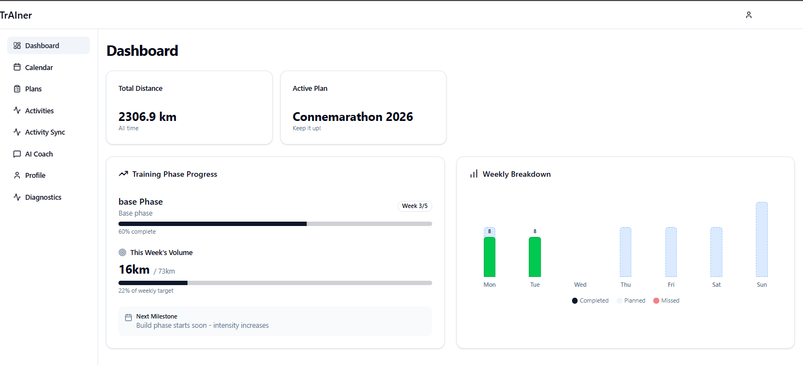

# trAIner

An AI-powered training platform for endurance athletes, primarily focused on marathon and distance running. trAIner combines intelligent training plan generation with multi-provider AI coaching to help athletes train smarter and achieve their goals.



## Features

### Training Plan Generation
- **Periodized training plans** based on proven methodologies (Hansons, Pfitzinger, Jack Daniels, Hal Higdon, Steve Magness)
- **Intelligent phase distribution**: Base, Build, Peak, and Taper phases automatically calculated based on goal race date
- **Multiple race distances**: Marathon, Half Marathon, 10K, 5K
- **VDOT-based pacing**: Training paces calculated from recent race results or time trials

### AI Coaching Chat
- **Multi-provider support**: Choose from Anthropic Claude, OpenAI, Google Gemini, DeepSeek, or Grok
- **Context-aware coaching**: AI has full access to your training history, current plan, and recent activities
- **Interactive plan refinement**: Chat with your AI coach to adjust workouts, modify schedules, or discuss training philosophy
- **Session history**: All coaching conversations are saved and retrievable

### Activity Tracking
- **Garmin integration** with direct API authentication
- **Strava integration** with OAuth authentication
- **Intelligent activity merging**: Automatically detects and suggests merging duplicate activities from different platforms
- **Workout matching**: Links completed activities to planned workouts

### Automated Observations
- **Missed workout detection**: Tracks when planned workouts aren't completed
- **Volume gap analysis**: Identifies periods of low training volume
- **Fatigue monitoring**: Detects patterns that may indicate overtraining
- **AI-powered adjustments**: Automatically proposes plan modifications based on observations

### Plan Management
- **Drag-and-drop calendar**: Easily reschedule workouts using an interactive calendar interface
- **Weekly progress tracking**: Visualize mileage and intensity trends over time
- **Phase progress indicators**: Track completion status of each training phase
- **Plan templates**: Browse and customize pre-built training plans

## Screenshots

| Feature |
|---------|
| [Dashboard Overview](screenshots/dashboard.png) |
| [Training Calendar](screenshots/calendar.png) |
| [AI Coach Chat](screenshots/chat.png) |
| [Activity Sync](screenshots/activity-sync.png) |
| [Activity Review](screenshots/activities.png) |
| [Plan Generation](screenshots/plan-generator.png) |

## Installation

### Prerequisites

- **Node.js** 20.x or later
- **npm** 10.x or later
- **Supabase account** (free tier works fine)
- **At least one LLM API key** from:
  - Anthropic (Claude)
  - OpenAI (GPT-4)
  - Google AI (Gemini)
  - DeepSeek
  - xAI (Grok)

### Optional Services

- **Strava account** for activity sync
- **Garmin Connect account** for activity sync

### Setup Steps

1. **Clone the repository**
   ```bash
   git clone https://github.com/yourusername/trAIner.git
   cd trAIner
   ```

2. **Install dependencies**
   ```bash
   npm install
   ```

3. **Set up Supabase**
   - Create a new project at [supabase.com](https://supabase.com)
   - Copy your project URL and anon key
   - Run the migrations in the `supabase/migrations/` directory (use Supabase CLI or the SQL editor)

4. **Configure environment variables**
   - Copy `.env.example` to `.env.local`
   ```bash
   cp .env.example .env.local
   ```
   - Fill in your Supabase credentials
   - Add at least one LLM provider API key
   - Optionally configure Strava credentials

5. **Run the development server**
   ```bash
   npm run dev
   ```
   Open [http://localhost:3000](http://localhost:3000) in your browser.

## Configuration

### LLM Provider Selection

trAIner supports multiple AI providers. Configure your preferred provider in `.env.local`:

```bash
LLM_PROVIDER=anthropic  # Options: anthropic, openai, gemini, deepseek, grok
```

Add the corresponding API key:
```bash
ANTHROPIC_API_KEY=sk-ant-...
OPENAI_API_KEY=sk-proj-...
GEMINI_API_KEY=AIza...
DEEPSEEK_API_KEY=sk-...
XAI_API_KEY=xai-...
```

Users can also switch providers in the application settings without redeploying.

### Strava Integration

To enable Strava activity sync:

1. Create a Strava API application at [strava.com/settings/api](https://www.strava.com/settings/api)
2. Set the authorization callback domain to `http://localhost:3000/api/strava/callback` (or your production domain)
3. Add the credentials to `.env.local`:
   ```bash
   STRAVA_CLIENT_ID=your_client_id
   STRAVA_CLIENT_SECRET=your_client_secret
   STRAVA_REDIRECT_URI=http://localhost:3000/api/strava/callback
   ```

### Garmin Integration

Garmin integration uses the `garmin-connect` npm package with direct API authentication:

1. Navigate to **Profile → Integrations** in the application
2. Click **Connect** next to Garmin Connect
3. Enter your Garmin Connect email and password
4. Your credentials are used only to obtain authentication tokens and are not stored

**Note**: If you have multi-factor authentication (MFA) enabled on your Garmin account, you'll need to temporarily disable it or use Strava sync instead. The `garmin-connect` library does not currently support MFA.

Authentication tokens are stored securely in the database and automatically refreshed as needed.

## Architecture

### Tech Stack

- **Frontend**: Next.js 16 (App Router), React 19, TailwindCSS 4
- **Backend**: Next.js API Routes
- **Database**: Supabase (PostgreSQL)
- **AI Integration**: Provider-agnostic factory pattern supporting multiple LLM APIs
- **State Management**: React Query (TanStack Query)
- **UI Components**: Radix UI primitives, shadcn/ui conventions
- **Calendar**: react-big-calendar with drag-and-drop support

### Key Design Patterns

**LLM Provider Abstraction**: A factory pattern (`lib/agent/factory.ts`) allows seamless switching between AI providers. Each provider implements a common interface (`lib/agent/provider-interface.ts`), making it easy to add new LLMs without changing application code.

**Context-Aware Coaching**: The AI coaching system loads comprehensive context about the athlete (current plan, recent activities, observations, settings) before each chat interaction, enabling relevant and personalized guidance.

**Observation-Driven Adjustments**: A flag detection system continuously monitors training patterns and automatically proposes adjustments, which users can review and apply through the UI.

### Project Structure

```
app/                    # Next.js App Router pages
  api/                  # API route handlers
  dashboard/            # Main application pages
components/             # React components
  ui/                   # Base UI components (Radix/shadcn)
  activities/           # Activity-specific components
  calendar/             # Calendar and scheduling
  chat/                 # AI coach interface
lib/                    # Core application logic
  agent/                # AI provider abstraction
  planning/             # Training plan generation
  activities/           # Activity matching and merging
  analysis/             # Observation and adjustment systems
  garmin/               # Garmin Connect API client
  strava/               # Strava API client
  supabase/             # Database queries and utilities
types/                  # TypeScript type definitions
supabase/migrations/    # Database migrations
```

## Training Philosophies

trAIner's training plan templates are inspired by well-established marathon training methodologies:

- **Hansons Method**: Cumulative fatigue training with moderate long runs
- **Pfitzinger**: High-mileage approach with lactate threshold work
- **Jack Daniels**: VDOT-based pacing with structured intensity
- **Hal Higdon**: Accessible plans for runners of all levels
- **Steve Magness**: Science-based approach balancing stress and recovery

Plans are automatically periodized into Base, Build, Peak, and Taper phases based on your goal race date and current fitness.

## Development

### Build Commands

```bash
npm run dev          # Development server (port 3000)
npm run build        # Production build
npm start            # Run production server
npm run lint         # Run ESLint
```

### Database Migrations

To apply database migrations:

1. Install the Supabase CLI
2. Link your project: `supabase link --project-ref your-project-ref`
3. Apply migrations: `supabase db push`

Alternatively, copy the SQL from `supabase/migrations/` and run it in the Supabase SQL editor.

## License

MIT License - see [LICENSE](LICENSE) file for details.

Copyright 2025 Gary Condon

## Contributing

Contributions are welcome! Please feel free to submit issues or pull requests.

For major changes, please open an issue first to discuss what you would like to change.

## Acknowledgments

- Training methodologies inspired by Hansons, Pfitzinger, Jack Daniels, Hal Higdon, and Steve Magness
- UI components built with [Radix UI](https://www.radix-ui.com/) and [shadcn/ui](https://ui.shadcn.com/)
- Database and authentication powered by [Supabase](https://supabase.com/)
- AI coaching enabled by [Anthropic](https://www.anthropic.com/), [OpenAI](https://openai.com/), [Google AI](https://ai.google.dev/), [DeepSeek](https://www.deepseek.com/), and [xAI](https://x.ai/)

## Support

For questions, issues, or feature requests, please [open an issue](https://github.com/yourusername/trAIner/issues) on GitHub.

---

**Note**: trAIner is a personal project and training tool. The AI coaching features provide guidance based on established training principles, but should not replace advice from qualified coaches or medical professionals. Always listen to your body and consult with healthcare providers before starting a new training program.
