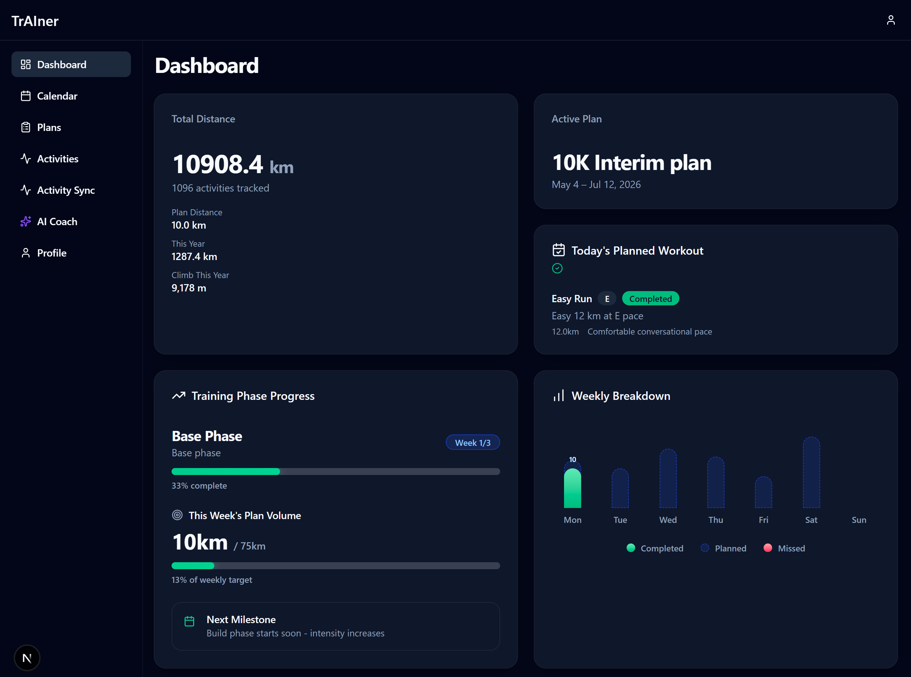

# trAIner

A closed-loop training platform for runners. trAIner generates plans with foundations based on established coaching methodologies — **Jack Daniels, Pfitzinger, Steve Magness, Hansons, Hal Higdon, Couch 2 5K** — schedules your workouts on your Garmin watch, syncs your activities back from **Garmin and Strava**, scores compliance lap-by-lap, and feeds the resulting context to a context-aware **AI coach** that knows your plan, your recent training, and your per-workout pace targets. The platform supports everyone from absolute beginners (time-based run/walk intervals) to elite marathoners (200km per week runners), across 5K through marathon.



## What makes it different

- **Methodology-faithful**: plans encode the structural rules of different methodologies and approaches (e.g. Daniels Q1/Q2 days, Pfitz threshold logic, Magness's hard-easy patterns), rather than non-specific generalized "ramp volume + add some intervals" templates.
- **Closed-loop**: completed activities are scored against planned workouts with lap-level fidelity. Missed workouts, volume gaps, and fatigue patterns surface as **observations** that the AI coach proposes specific adjustments for — accepted or rejected by you.
- **Bidirectional Garmin integration**: sync activities in, push structured workouts (with pace targets and warmup/cooldown) out to your watch.
- **Multi-provider AI**: pick from Google Gemini, DeepSeek, Anthropic Claude, OpenAI, or Grok per user; plan-generation defaults to a high-throughput model independent of your chat preference.
- **Multi-user with admin approval**: self-registration, admin-gated activation, per-user data isolation, account deletion.

## Human-centred design

trAIner is built on the assertion that LLMs are good at synthesising and interpreting structured information and poor at improvising training science. The system constrains the AI's role accordingly, guided by templates, but providing flexibility to schedule and scale training plans.
- **You choose the methodology.** The plan catalog is filtered by rule against your criteria (distance, current and peak mileage, weeks available, experience level) and presented as a ranked shortlist with explicit reasoning. You pick the template; no LLM picks for you. (`lib/templates/catalog-filter.ts`)
- **Pace targets come from VDOT, not the LLM.** Paces are computed deterministically from the athlete's VDOT using Daniels' published formulae and stamped into each workout before write. The LLM is told not to calculate them. (`lib/plans/plan-writer.ts`, `lib/training/vdot.ts`)
- **Structural validation gates every plan.** After generation, structural assertions check week count, race-day correctness, day numbering, and main-set integrity. Blocking failures reject the plan; the user never sees a malformed one. (`lib/plans/structural-assertions.ts`)
- **The athlete keeps decision authority.** Adjustments proposed by the system appear as accept/reject cards, never auto-applied. Workout edits, splits, syncs are all explicit user actions. The coach favours data-driven deterministic transparency ("your tempo completion rate is 67%") over non-deterministic inference.
- **No medical advice.** The coach's system prompt explicitly forbids diagnosis, prescription, or symptom interpretation — only redirects to qualified professionals. Training guidance, not medical guidance. (`lib/agent/coach-prompt.ts`)
- **You choose where your data goes.** The LLM provider is per-user; your plan and training data go only to the model you configure. No third-party telemetry, no cross-user sharing. (Your display name and any injury notes you record are included in coach context; email, auth tokens, and other identifiers are never sent.)

## Features

### Plan generation
- Multiple methodologies and distances (**5K, 10K, half-marathon, marathon**); peak mileage tiers from beginner up to 120+ mpw.
- **VDOT-based pacing** stamped into each workout at generation time (race-time, time-trial, or self-reported).
- **Time-based and distance-based plans** — supports run/walk programmes (e.g. C25K) alongside conventional distance plans.
- Automatic **periodization** (Base / Build / Peak / Taper) aligned with your goal date.

### AI coaching
- **Context-aware**: plan, recent activities, lap detail, pace targets, observations, athlete profile.
- **Plan refinement**: chat to reschedule, swap, or restructure workouts; proposed changes appear as accept/reject cards.
- **Per-workout discussion**: jump from a workout in the calendar straight into a coach session about that workout.
- **AI activity summaries**: every imported run gets a generated summary (with lap analysis) stored on the activity card.

### Workout management
- **Drag-and-drop calendar** (month view) with running-only filter and weekly totals.
- **Manual create / edit / delete** workouts; structured workout editor for warmup/main set/cooldown with explicit pace targets.
- **Split-run support**: split easy/long/recovery into Run 1 + Run 2 on the same date; merge back symmetrically.
- **Garmin export**: send a single workout or a whole week to Garmin Connect; remove from GC; sync state tracked per workout.
- **ICS calendar export** for use in Apple/Google/Outlook calendars.
- **Workout reschedule**: inline drag, or pick a date from the workout card.

### Activity tracking
- **Garmin and Strava** sync, with **automatic deduplication** when both are connected.
- **Lap-level detail** (Garmin) imported into a `laps` table with split type, intensity, and compliance scores.
- **Auto-match** activities to planned workouts on import; manual override available.
- **Activity merging** UI for resolving cross-platform duplicates.

### Observations & adjustments
- Continuous flag detection: missed workouts, volume gaps, fatigue indicators.
- AI proposes specific plan modifications; user reviews and applies.
- Phase progress tracked per training phase.

### Multi-user
- Self-registration with email-triggered admin approval.
- Per-user training plans, integrations, AI provider preference, unit system (metric/imperial), week-start day, dark mode.
- Admin-only user-management UI.
- Self-service account deletion with full data wipe.

## Screenshots

| | |
|---|---|
| [Dashboard](screenshots/Dark_Dashboard.png) — overview with today's workout, phase progress, weekly chart | [Calendar](screenshots/Dark_Calendar.png) — drag-and-drop, weekly totals, split-run badges |
| [AI Coach](screenshots/Dark_AICoach.png) — context-aware chat with workout discussion | [Plan Generation](screenshots/Dark_CreatePlan.png) — template selection and goal setup |
| [Workout Detail](screenshots/Dark_WorkoutCard.png) — structured workout, split, Garmin send | [AI Activity Summary](screenshots/Dark_ActivityCard.png) — generated summary with lap analysis |
| [Profile / Integrations](screenshots/Dark_Profile.png) — Garmin/Strava status, LLM provider, units | [Activity Lap Analysis](screenshots/Dark_LapView.png) — Per-lap analysis with plan alignment  |
| [Mobile](screenshots/Dark_Mobile.jpeg) — responsive layout on phone |

## Installation

### Prerequisites

- Node.js 20.x+, npm 10.x+
- Supabase project (free tier is fine)
- At least one LLM API key: DeepSeek, Anthropic, OpenAI, Google Gemini, or xAI

### Optional

- Strava API app for Strava sync
- Garmin Connect account (without MFA — see note below)

### Setup

```bash
git clone https://github.com/GaryRPCondon/training-platform-app.git
cd training-platform-app
npm install
cp .env.example .env.local   # fill in Supabase + LLM keys
# Apply migrations to your Supabase project (Supabase CLI or SQL editor)
npm run dev
```

Open <http://localhost:3000> and create the first user; that account becomes admin and can approve subsequent registrations.

## Configuration

### LLM providers

Each user picks their preferred chat provider in **Profile → AI Settings**. Plan generation uses your preference if set, falling back to Gemini Flash Lite when no preference is set and `GEMINI_API_KEY` is present (chosen for output token capacity, not chat quality).

```env
ANTHROPIC_API_KEY=...
OPENAI_API_KEY=...
GEMINI_API_KEY=...
DEEPSEEK_API_KEY=...
XAI_API_KEY=...
```

### Strava

```env
STRAVA_CLIENT_ID=...
STRAVA_CLIENT_SECRET=...
STRAVA_REDIRECT_URI=http://localhost:3000/api/strava/callback
```

Set the authorization callback domain in your Strava API app to match.

### Garmin

Connect from **Profile → Integrations**. Credentials are exchanged for OAuth tokens (stored encrypted-at-rest by Supabase) and not retained.

> **MFA note**: the `garmin-connect` library does not currently support MFA. If your Garmin account has MFA enabled, either temporarily disable it or rely on Strava sync.

## Architecture

### Stack

- **Next.js 16** (App Router) + React 19, TypeScript, TailwindCSS 4
- **Supabase** (Postgres + auth + RLS); migrations under `supabase/migrations/`
- **TanStack Query** for client state; React Server Components for server data
- **Radix UI** primitives via shadcn/ui conventions
- **Vitest** test suite (~230 tests; run as a pre-commit hook)

### Key modules

- `lib/agent/` — provider-agnostic LLM factory + context loader (athlete, plan, week, recent activities, lap detail, observations).
- `lib/plans/` — plan generation, structured-workout builder, pace stamping, response parser, validation. Templates live in the `plan_templates` Supabase table.
- `lib/training/vdot.ts` — VDOT/race-time → training paces.
- `lib/garmin/` — Garmin Connect client (OAuth1+2), workout mapper (Garmin JSON), lap importer.
- `lib/strava/` — Strava OAuth + activity sync.
- `lib/activities/` — auto-match, duplicate detection, scoring.
- `lib/analysis/` — flag detector, observation manager, adjustment proposer/persistence, phase progress.
- `app/api/workouts/{split,unsplit,reschedule,update}` — calendar workout mutations.
- `app/api/garmin/workouts` — Garmin workout export (send / remove).
- `proxy.ts` — global auth gate (Supabase SSR) for all dashboard routes.


## Development

```bash
npm run dev          # dev server
npm run build        # production build
npm start            # serve build
npm run lint         # ESLint
npm run test         # Vitest run
npm run test:watch   # Vitest watch
```

### Migrations

Apply with `supabase db push` if your project is linked, or copy individual SQL files from `supabase/migrations/` into the Supabase SQL editor.

## Security

The codebase has been through a defensive audit covering: IDOR on observation/adjustment endpoints, CSRF on the Strava OAuth dance, account-creation hardening (admin-only with email verification), security headers (HSTS, X-Frame-Options, Permissions-Policy), and dependency audit. See migration history for individual fixes.

## License

MIT — see [LICENSE](LICENSE). Copyright 2025–2026 Gary Condon.

## Disclaimer

trAIner is a personal project. AI coaching guidance is grounded in established training principles but is not a substitute for advice from a qualified coach or medical professional.
